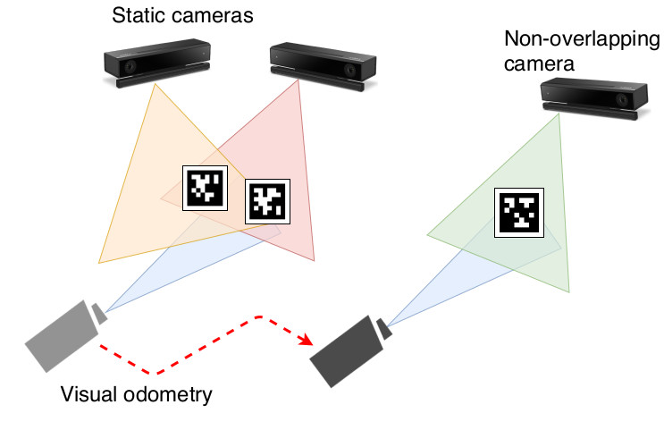

## sparse\_dynamic\_calibration

This is a ROS package to calibrate a camera network consisting of not only static overlapping cameras but also dynamic and non-overlapping cameras. It bridges separated camera views using a dynamic support camera with visual odometry, and estimates all the static and dynamic camera poses based on pose graph optimization. It has an optional depth image-based refinement step for RGB-D cameras.

The calibration method itself is designed for general camera networks. But, it also provides some scripts to incorporate with [OpenPTrack](https://github.com/OpenPTrack/open_ptrack_v2), an RGB-D camera network-based human-machine interaction framework.

This package has been testes on ROS melodic on Ubuntu 18.04



[video](https://drive.google.com/open?id=1DCjfVUMr8ZSkOYbvwpIQUm4A_jY4PIMi)

## Installation

### Apriltag

```bash
git clone https://github.com/AprilRobotics/apriltags.git
cd apriltags && sudo make install
```

### Visual odometry

In this work, we use [Direct Sparse Odometry](https://github.com/JakobEngel/dso) to obtain the camera motion. However, you can replace it with any visual odometry algortihm. Only the requirement is that it publishes the estimated odometry to "*/vodom (geometry\_msgs::PoseStamped)*" topic.

#### DSO

```bash
# (Recommended) Install Pangolin (https://github.com/stevenlovegrove/Pangolin)

git clone https://github.com/koide3/dso.git
mkdir dso/build && cd dso/build
cmake ..
make -j4

echo "export DSO_PATH=/path/to/dso" >> ~/.bashrc
soruce ~/.bashrc


cd catkin_ws/src
git clone https://github.com/koide3/dso_ros.git
cd dso_ros && git checkout catkin
cd ../.. && catkin_make
```

### sparse_dynamic_calibration

```bash
cd catkin_ws/src
git clone https://github.com/koide3/sparse_dynamic_calibration.git
cd .. && catkin_make
```

## Usage

### Detecting tags from static cameras

Edit "*data/tags.yaml*" to specify the tag size.

```yaml
%YAML:1.0
default_tag_size: 0.160
```

Then, launch "*generate\_tag\_camera\_network\_conf.launch*" to detect tags from the static cameras. It automatically detects cameras by findind topics which match with a regex pattern (e.g., "(/kinect.*)/rgb/image"), and then extracts image data from topics of the detected cameras (/rgb/camera\_info, /rgb/image, /depth\_ir/points). You can change the pattern and topic names by editing the launch file.

```bash
roslaunch sparse_dynamic_calibration generate_tag_camera_network_conf.launch
```

### Recording dynamic camera image stream

Record an image stream and visual odometry data using a dynamic camera.

```bash
# in case you use a pointgrey camera
roslaunch sparse_dynamic_calibration camera.launch

#otherwise, use any other camera node like usb_cam
```

```bash
roslaunch dso_ros dso.launch
```

Although the calibration method itself is an online method, we recommend to run the calibration on a rosbag for testing.

```bash
rosbag record -O test.bag -e "/camera/(camera_info|image_raw/compressed)" /vodom /points
```

### Running calibration

```bash
rosparam set use_sim_time true
roslaunch sparse_dynamic_calibration calibrate.launch
```

```bash
roscd sparse_dynamic_calibration/config
rviz -d rviz.rviz
```

```bash
rosrun image_transport republish compressed in:=/camera/image_raw raw out:=/camera/image_raw
```

```bash
rosbag play --clock test.bag
```

After finishing to play the rosbag, save the estimate poses:

```bash
rostopic pub /sparse_dynamic_calibration/save std_msgs/Empty
```

You should be able to see the calibrated camera poses in *"data/tag\_camera\_poses.yaml"*.


### Depth image-based refinement (optional)

```bash
rosparam set use_sim_time false
roslaunch sparse_dynamic_calibration refinement.launch
```

Refined camera poses will be saved to "*data/tag\_camera\_poses\_refined.yaml*".

### Copying estimated posed to OpenPTrack

After calibrating the camera network, copy the estimated camera poses with:
```bash
rosrun sparse_dynamic_calibration copy_to_openptrack.py
```

This script reads the estimated camera poses in "*data/tag\_camera\_poses.yaml*" and writes them into "opt\_calibration/launch/opt\_calibration\_results.launch" and "opt\_calibration/conf/camera\_poses.yaml". Then, distribute the calibration result to each PC:

```bash
# On master PC
roslaunch opt_calibration detection_initializer.launch
```

```bash
# On each distributed PC
roslaunch opt_calibration listener.launch
```


## Related work
Kenji Koide and Emanuele Menegatti, Sparse and Dynamic RGB-D Camera Network Calibration with Visual Odometry, IROS2019 (under review).
